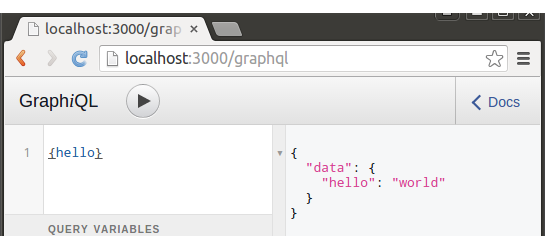

GraphQL + NodeJS + Express + ES6 Boilerplate
============================================
The intention of this project is to demonstrate a basic NodeJS app with a GraphQL endpoint.

If you are using Debian/Ubuntu, it's best to follow [these instructions](http://www.hostingadvice.com/how-to/install-nodejs-ubuntu-14-04) for installing nodejs.
 
This project was created on a fresh installation of Ubuntu 15.04 (64-bit) with nodejs version 4.2.1, npm version 2.14.7 and git version 2.1.4.
I have also tested successfully on Windows 8.1 (64-bit).
```
$ npm install
$ node index.js
```

Navigate to [http://localhost:3000/graphql](http://localhost:3000/graphql) to open the [GraphiQL](https://github.com/graphql/graphiql) in-browser editor.

On the left side, enter 
```json
{ hello }
```

Press the play button.

If your app is working correctly, you should see the following response on the right side:
```json
{
    "data": {
        "hello": "world"
    }
}
```

This is what you should see in your browser:


###Further Reading
* [express-graphql - Create a GraphQL HTTP server with Express](https://github.com/graphql/express-graphql)
* [graphql-js - A reference implementation of GraphQL for JavaScript](https://github.com/graphql/graphql-js)
* [Learn GraphQL](https://learngraphql.com/)
* [GraphQL.org](http://graphql.org/)